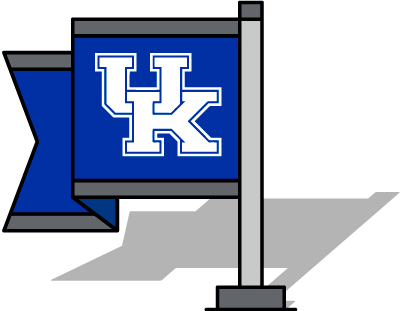

---?color=linear-gradient(to bottom, #c7c9c8, #63666a)
@snap[north north-pin]
# Where is
## your research location?
@snapend

@snap[south img-pin]

@snapend

---?color=linear-gradient(to bottom,  #c7c9c8, #63666a)
@snap[north-pin]
# Goal
@snapend
* In celebration of the Department's 75th Anniversary, we like to map the field work locations for dissertations, theses, and other significant publications in the department.
* We are asking alums to submit information that can help locate their work.

---?color=linear-gradient(to bottom,#c7c9c8, #63666a)
@snap[north-pin]
# Example
### New Maps Plus student locations
Click on a map pin for the popup content.
@snapend

---?color=linear-gradient(to bottom,#c7c9c8, #63666a)
<iframe src='https://newmapsplus.github.io/projects/' width='550px' height='600px'></iframe>

---?color=linear-gradient(to bottom,  #c7c9c8, #63666a)
@snap[north-pin]
# Titles
@snapend
<iframe src='https://boydx.github.io/get-mapped/titles.html' width='100%' height='400px'></iframe>

---?color=linear-gradient(to bottom,  #c7c9c8, #63666a)
@snap[north-pin]
# Survey
@snapend
* If you know a research location, please complete the form on the next page.
* Provide a zip code and/or a country and state/territory.
* Any other info you provide will be added as content in the pin's popup.

---?survey=https://docs.google.com/forms/d/e/1FAIpQLScoVALzU0oiq2jipTYn1u-DgGV5GuDSK88RCj0R8umjmfYEVQ/viewform?usp=sf_link
[Form link](https://docs.google.com/forms/d/e/1FAIpQLScoVALzU0oiq2jipTYn1u-DgGV5GuDSK88RCj0R8umjmfYEVQ/viewform?usp=sf_link)

<!-- ---?color=linear-gradient(to bottom, #009bda, #1AAAAC) -->
---?color=linear-gradient(to bottom,  #c7c9c8, #63666a)
@snap[north north-pin]
# Thank you!
@snapend

@snap[south img-pin]

@snapend
<!-- ---?color=linear-gradient(to bottom, #009bda, #63666a) -->